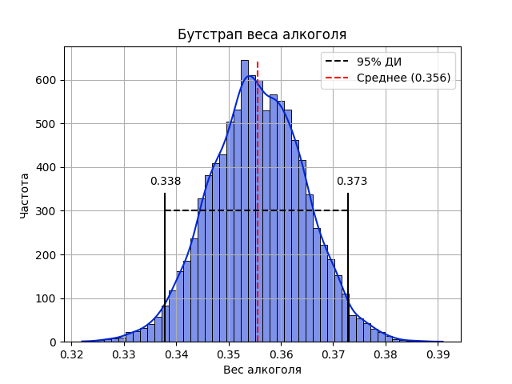
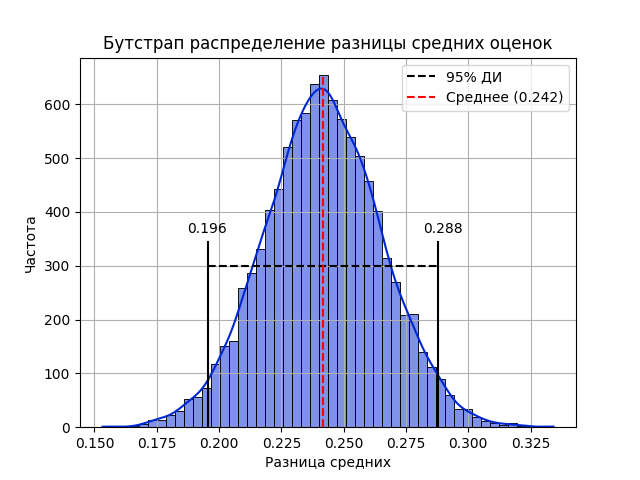
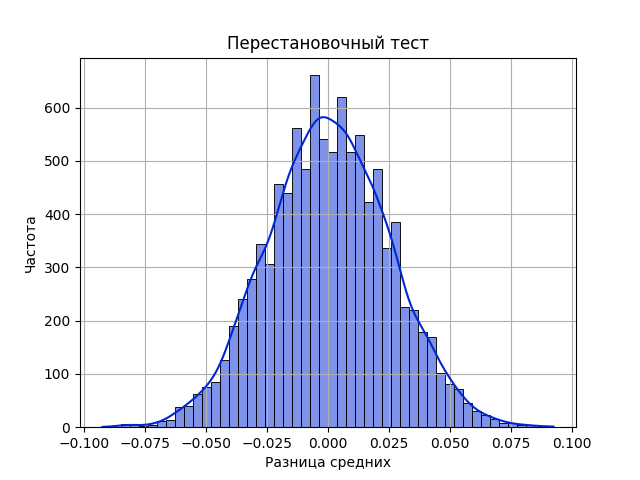

# 🍷 Wine Analysis — статистическое исследование качества вина

---

## 🎯 Цель
Изучить, как химические параметры вина (алкоголь, кислотность и др.) влияют на его качество.  
Сравнить красное и белое вино при помощи **t-теста Уэлча**, построить **линейную регрессию**,  
и проверить устойчивость выводов с помощью **бутстрапа доверительных интервалов**.

---

## ⚙️ Инструменты
Python, NumPy, Pandas, SciPy, Seaborn, Matplotlib, Jupyter Notebook

---

## 📁 Содержимое проекта
```
01_wine_analysis/
├── data/
│ └── winequality.csv
├── wine_analysis.ipynb
├── report.pdf
└── README.md
```
---

## 📈 Основные результаты
- Разница между средним качеством красного и белого вина статистически значима (p < 0.001)  
- Коэффициент при `alcohol` в модели также значим (p < 0.001)  
- Бутстрап-интервалы почти совпадают с аналитическими → предпосылки МНК выполнены  

---

## 📊 Визуализации

### 1️⃣ Влияние алкоголя (линейная регрессия)

📄 [PDF-версия](reports/alcohol.pdf)

---

### 2️⃣ Бутстрап разницы средних оценок (`Δmean`)

📄 [PDF-версия](reports/deltamean_bootstrap.pdf)

---

### 3️⃣ Перестановочный тест (reshuffle)

📄 [PDF-версия](reports/reshafle.pdf)


---

## 📚 Вывод
Модель подтверждает значимость признаков `alcohol` и `type`.  
Бутстрап показал устойчивость результатов, а совпадение с аналитическими интервалами  
указывает на корректность предположений классической регрессии.
